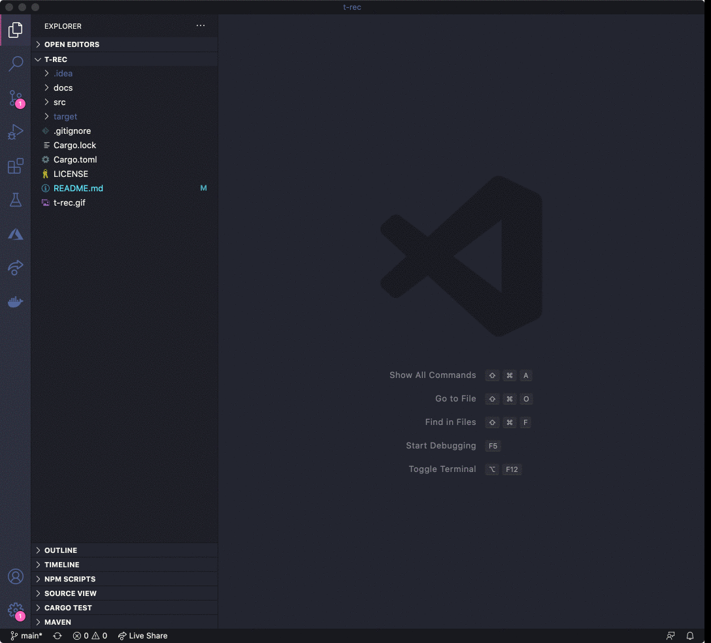

# Terminal Recorder - t-rec

[](https://www.gnu.org/licenses/gpl-3.0)
[](https://github.com/sassman/t-rec-rs/actions?query=branch%3Amain+workflow%3ABuild+)
[](https://github.com/Aaronepower/tokei)

Blazingly fast terminal recorder that generates animated gif images for the web written in rust.

# Demo


## Features

- Screenshotting your terminal with 4 frames per second (every 250ms)
- Generates high quality small sized animated gif images
- Runs (only) on MacOS
- Uses native efficient APIs
- Runs without any cloud service and entirely offline
- No issues with terminal sizes larger than 80x24
- No issues with fonts or colors
- No issues with curses based programs
- No issues with escape sequences
- No record and replay - just one simple command to rule them all
- Hidden feature: Record every window you want
- Written in Rust 🦀

## Install

**NOTE** Not yet published on crates.io due to a not yet released version of [core-foundation](https://github.com/servo/core-foundation-rs/pulls?q=is%3Apr+author%3Asassman+).

```sh
git clone https://github.com/sassman/t-rec-rs.git
cd t-rec-rs
cargo install --path . 
```

## Usage

```sh
❯ t-rec
```

or with specifying a different program to launch

```sh
❯ t-rec /bin/sh
```

### Hidden Gems

You can record not only the terminal but also every other window. There 2 ways to do so:

1) abuse the env var `TERM_PROGRAM` like this:
- for example lets record a window 'Google Chrome'
- make sure chrome is running and visible on screen

```sh
❯ TERM_PROGRAM="google chrome" t-rec
tmp path: "/var/folders/m8/084p1v0x4770rpwpkrgl5b6h0000gn/T/trec-74728.rUxBx3ohGiQ2"
Press Ctrl+D to end recording
[src/window_id.rs:122] window_owner = "Google Chrome 2"
```

this is how it looks then:


2) use the env var `WINDOWID` like this:
- for example let's record a `VSCode` window
- figure out the window id program, and make it 
- make sure the window is visible on screen
- set the variable and run `t-rec`

```sh
❯ t-rec --ls-win | grep -i code
Code | 27600

# set the WINDOWID variable and run t-rec
❯ WINDOWID=27600 t-rec

tmp path: "/var/folders/m8/084p1v0x4770rpwpkrgl5b6h0000gn/T/trec-77862.BMYiHNRWqv9Y"
Press Ctrl+D to end recording

```

this is how it looks then:


## Contribute

To contribute to t-rec you can either checkout existing issues [labeled with `good first issue`][4] or [open a new issue][5] and describe your problem.
Also every PR is welcome. Support for Linux and Windows needs to be done.

## License

- **[GNU GPL v3 license](https://www.gnu.org/licenses/gpl-3.0)**
- Copyright 2020 © [Sven Assmann][2].

[2]: https://www.d34dl0ck.me
[4]: https://github.com/sassman/t-rec-rs/issues?q=is%3Aissue+is%3Aopen+label%3A%22good+first+issue%22
[5]: https://github.com/sassman/t-rec-rs/issues/new/choose
